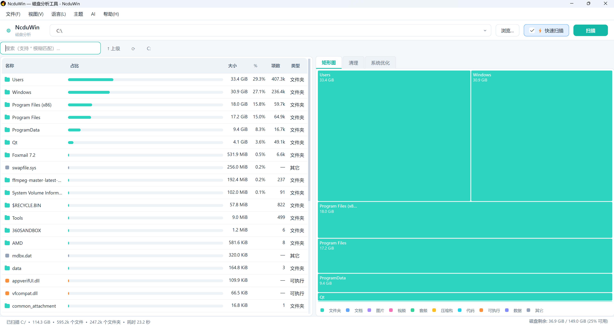
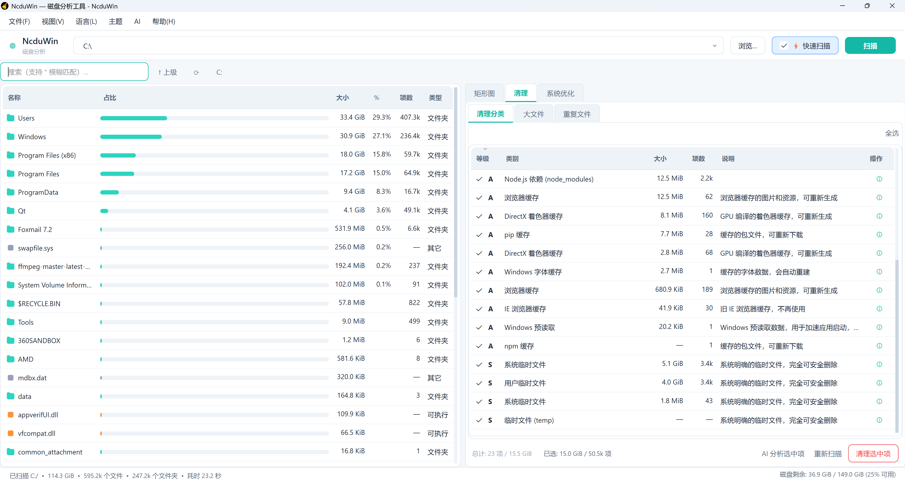
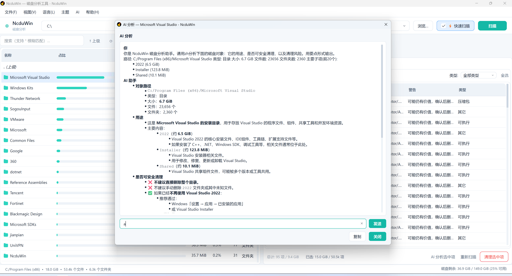
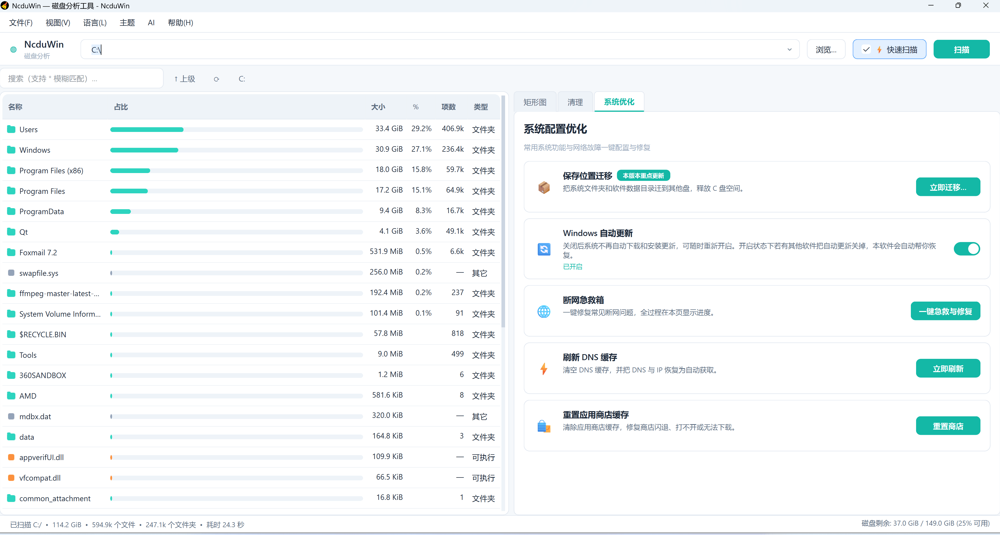
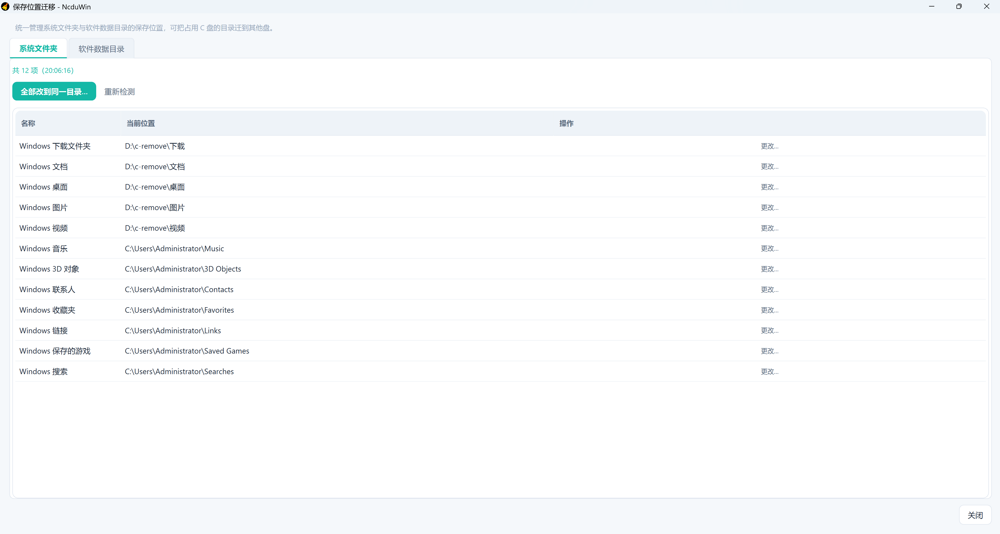
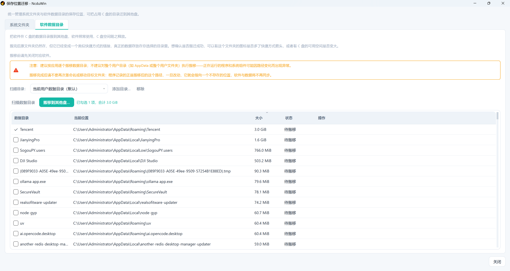

# NcduWin

[](LICENSE)
[](https://en.cppreference.com/w/cpp/17)
[](https://www.qt.io)
[](#supported-platforms)
[](#)

**[English](README.md)** | **[中文](README_ZH.md)**

> A modern, light-themed disk usage analyzer for Windows, inspired by Linux [`ncdu`](https://dev.yorhel.nl/ncdu).

NcduWin is a native desktop application that scans your disk and visualizes
folder sizes with both an ncdu-style file list **and** a squarified treemap.
It is built with **C++17 and Qt 6**, ships as an installer with all
dependencies bundled, and supports English / 简体中文 out of the box.

---

## ✨ Features

- **Blazing fast scanning** — directly reads the NTFS Master File Table
  (MFT) to enumerate files, delivering scan speeds several times faster
  than traditional directory-walking approaches. Multi-threaded processing
  keeps large drives responsive.
- **Duplicate file finder** — three-stage funnel (size grouping →
  first-4KB hash → full hash) identifies duplicate files with minimal
  I/O and memory. Safely skips system binaries and user data; the first
  file in each group is kept by default.
- **AI analysis** — hand a file, folder or pending cleanup item to the AI to
  explain what it is, whether it is safe to remove and what the risk is, then
  keep asking follow-up questions. Works with any OpenAI-style endpoint; the
  Base URL, API key and model are configurable under **AI → AI settings**.
- **Theme switching** — switch between light and dark themes, or define
  your own custom accent colors for a personalized look.
- **Skip heavy directories** — optionally skip deep scanning of large
  folders like `node_modules` and `.git` while still showing their sizes.
- **Full system access** — auto-requests admin privileges to scan protected
  system folders like `C:\Windows` and other users' directories.
- **Dual visualization** — ncdu-style file list on the left, interactive
  treemap on the right for intuitive space analysis.
- **Smart sorting** — click any column to sort by Name, Size, Percentage,
  File Count, or Type.
- **Software identification** — recognizes common software install folders
  (Adobe, JetBrains, Microsoft Office, Steam, etc.) and developer projects.
- **Breadcrumb navigation** — quickly jump to any parent directory.
- **Hover tooltips** — see full file paths and software identification
  on mouse hover.
- **Safe delete options** — right-click to send to Recycle Bin (undoable)
  or delete permanently.
- **One-click disk cleanup** — dedicated Cleanup tab detects and removes:
  - Common junk: temp files, browser caches, pip/npm caches
  - Large files (>50MB) with safety-level classification
  - Duplicate files with grouped selection
- **Safety-first deletion** — five-level safety system (S/A/B/C/D) ensures
  you won't accidentally delete important files. System state and user
  data are never auto-selected.
- **System optimization** — a dedicated System Optimization tab that fixes
  common system and network problems in one place:
  - Windows Update guard: toggle automatic updates off so nothing downloads
    or installs on its own, and turn them back on whenever you want
  - Network emergency repair: resets IP / DNS / IPv6 / Winsock / firewall
    and renews DHCP, with live progress for every step
  - Flush the DNS cache and reset the Microsoft Store cache
- **Relocate save locations** — move C-drive-hungry folders to another disk
  while a directory junction stays behind, so software keeps working with
  no reconfiguration:
  - System folders: Downloads / Documents / Desktop / Pictures / Videos /
    Music / 3D Objects / Contacts / Favorites / Links / Saved Games /
    Searches — all 12 Windows library folders
  - App data folders: scans AppData / LocalAppData / LocalLow and Documents
    for user data, with checkbox batch selection
- **Move safety net** — a stepwise copy → verify → create junction →
  remove source flow, with one-click restore if any step fails; the target
  folder gets a "do not delete, move or rename" marker so it is never
  removed by mistake and taken out of sync.
- **Programs holding the folder** — a move starts by checking which programs
  have the folder open, names each one with its PID, and offers to close them:
  ask politely first, force only what ignores the request. Critical system
  programs (Explorer, logon processes, security software) are never closed
  automatically and are only pointed out. A move that still does not finish
  shows the same list and can be retried; skipping a folder leaves it exactly
  as it was, unticked and ready to move later. A move that fails says which
  program is in the way, why it cannot be closed, and whether to quit it by
  hand or restart and retry immediately — never just "a program is using it".
- **A restore checks nobody is using the original folder first** — moving back
  empties the original location before writing the data into it, which cannot be
  done while the program that owns the data is running: it would write into a
  folder being emptied under it, and the copy that comes back could never be
  verified. So "restore" asks who is holding the folder before it touches
  anything. Closable programs get one offer to be closed, and are re-checked
  afterwards; if they cannot go — or restart themselves — the restore simply
  does not start, leaves the junction and both copies exactly as they were, and
  says who is in the way and whether to quit it by hand or retry after a reboot.
- **Leftovers are cleaned up, not left behind** — when a restore cannot delete
  the copy it made because files inside are still open, it does not report
  success and move on: it names the holders, offers to close them, and tries
  again. Whatever remains is recorded as this app's own, the row grows a
  "remove leftover" action, and a later move offers to clear it instead of
  stopping at "a folder with that name already exists".
- **Filter by status** — the Status column of the app data folder list carries
  its own filter: tick several states at once (say "Incomplete" and "Ready") and
  the panel stays open while you do. Filtered-out folders are hidden, not
  dropped, so their ticks survive; the totals, and the move itself, only ever
  count the rows you can see.
- **Scan timing** — the status bar shows how long each scan actually took,
  formatted as ms / s / min-s / h-min.
- **Auto-scan on startup** — instantly shows your home directory usage
  on first launch.
- **English and Chinese** — built-in localization with persistent language
  preference.
- **Clean, modern UI** — soft colors, rounded corners, and clear visual
  hierarchy.
- **Installer package** — one-click setup with desktop and Start Menu
  shortcuts; uninstaller included.

---

## 📸 Screenshots

| File list + treemap | Cleanup panel |
|---|---|
|  |  |

| AI analysis | System optimization |
|---|---|
|  |  |

| System folder relocation | User data folder relocation |
|---|---|
|  |  |

---

## 🚀 Quick start

### Option A — Download the release

1. Go to the [Releases](../../releases) page.
2. Download `NcduWin_Setup.exe`.
3. Run the installer and follow the prompts. No runtime required.

### Option B — Build from source

**Requirements:**
- Windows 10/11
- [Qt 6.x](https://www.qt.io/download) (msvc2019_64 or msvc2022_64)
- [CMake](https://cmake.org/download/) 3.16+
- Visual Studio 2022 (or Build Tools) with MSVC

```bash
git clone https://github.com/xiaodingfeng/ncdu-win-qt.git
cd ncdu-win-qt
scripts\build.bat
```

The script produces `dist\NcduWin_1.0.8_Setup.exe` — an installer with
all Qt dependencies bundled.

### Option C — Open in Visual Studio

1. Launch **Visual Studio 2022**.
2. **File → Open → Folder** and select the project root.
3. In the toolbar **Solution Configurations** dropdown, select **VS 2022 (Debug)**.
4. The **Startup Item** dropdown will show `NcduWin.exe` — select it.
5. Press **F5** to build and run.

> The project auto-detects your Qt 6 installation under `C:\Qt\6.x\`.
> Debug and Release builds both deploy the correct Qt DLLs automatically.

---

## 📁 Project layout

```
ncdu-win-qt/
├── src/                    # C++ source files
│   ├── main.cpp            # Entry point
│   ├── version.h.in        # Version template (processed by CMake)
│   ├── core/               # Core data & utilities
│   │   ├── DiskScanner.h/cpp
│   │   ├── FileNode.h
│   │   ├── FormatHelpers.h/cpp
│   │   ├── I18n.h/cpp
│   │   ├── Identify.h/cpp
│   │   ├── KnownFolderPath.h   # Known-folder resolution (incl. OneDrive redirects)
│   │   ├── KnownFolderTable.h  # Single source of truth for the 12 known folders
│   │   ├── Logger.h/cpp
│   │   ├── MemoryMonitor.h
│   │   ├── MftScanner.h/cpp    # NTFS MFT direct reader (fast path)
│   │   ├── MoveDstResolver.h   # Target path resolution for batch moves
│   │   ├── SafeMoveWorker.h/cpp  # Cancellable, verified move worker
│   │   ├── ScanRoots.h         # User-data scan roots
│   │   └── WinApi.h/cpp
│   ├── ui/                 # UI components
│   │   ├── AppDataMovePanel.h/cpp   # Application data relocation panel
│   │   ├── AppPathSyncDialog.h/cpp  # Known-folder relocation dialog
│   │   ├── BreadcrumbBar.h/cpp
│   │   ├── DialogI18n.h        # Shared confirm / info dialogs
│   │   ├── InstalledApps.h     # Installed-application discovery
│   │   ├── LegendBar.h/cpp
│   │   ├── MainWindow.h/cpp
│   │   ├── SizeBarDelegate.h/cpp
│   │   ├── Style.h
│   │   ├── SystemOptPanel.h/cpp    # System optimization panel
│   │   ├── ToggleSwitch.h/cpp
│   │   └── TreemapWidget.h/cpp
│   ├── ai/                 # AI analysis
│   │   ├── AiAnalysisDialog.h/cpp  # Analysis result window
│   │   ├── AiService.h/cpp         # Requests & streaming responses
│   │   └── AiSettingsDialog.h/cpp  # Model & API key settings
│   └── cleanup/            # Cleanup feature
│       ├── CleanupPanel.h/cpp
│       ├── CleanupScanner.h/cpp
│       ├── CleanupTarget.h
│       ├── CleanupWorker.h/cpp
│       └── DuplicateScanner.h/cpp  # Duplicate file detection
├── locales/                # i18n JSON files
│   ├── en.json
│   └── zh.json
├── scripts/
│   ├── build.bat           # Build script (CMake + MSVC + windeployqt + ISCC)
│   ├── check_i18n.py       # Translation audit (symmetry / coverage / dead keys)
│   ├── installer.iss       # Inno Setup installer script
│   └── version.iss.in      # Version template for installer
├── tests/
│   ├── test_scanner.cpp    # C++ unit tests (Qt Test)
│   └── compare_scanners.cpp  # Scanner comparison benchmarks
├── probe_lab/              # Regression harness (9 probes / 368 assertions)
│   ├── CMakeLists.txt
│   └── run1/ … run9/       # Move safety / marker names / known folders / language / lockers / leftovers / state filter
├── resources/              # Resources embedded into the binary
│   └── dont_delete_folder.ico  # "Do not delete" marker for move targets
├── docs/                   # Website & screenshots
│   ├── index.html
│   └── screenshots/
│       ├── treeMap.png
│       ├── cleanup.png
│       ├── ai.png
│       ├── system.png
│       ├── systemMenu.png
│       └── userMenu.png
├── app.ico
├── app.manifest
├── CMakeLists.txt
├── CMakePresets.json
├── CMakeSettings.json
├── LICENSE
├── README.md
└── README_ZH.md
```

---

## ⌨️ Keyboard shortcuts

| Shortcut | Action |
|---|---|
| `Ctrl+O` | Open folder… |
| `F5` | Re-scan current |
| `Ctrl+Q` | Quit |
| `Backspace` | Go to parent folder |
| `Enter` / `Return` | Open selected folder |
| `Delete` | Move selection to Recycle Bin |
| `Shift+Delete` | Delete selection permanently |
| `Ctrl+F` | Focus the search box |
| `Esc` | Clear search / go up |

---

## 🌍 Adding a translation

1. Copy `locales/en.json` to `locales/<code>.json`
   (e.g. `ja.json`, `fr.json`).
2. Translate the values.
3. Register the language in `src/core/I18n.cpp`:
   ```cpp
   {"en", "English"},
   {"zh", "简体中文"},
   {"ja", "日本語"},
   ```
4. The new language will automatically appear in the **Language** menu.

---

## 🧪 Development

### Command line
```bash
scripts\build.bat
build\Release\test_scanner.exe   # run unit tests
```

### Visual Studio
Open the project folder and select the **VS 2022 (Debug)** preset.
Debug and Release builds are both supported — Qt DLLs deploy automatically.

---

## 📝 License

MIT © NcduWin Contributors. See [LICENSE](LICENSE).

This project is inspired by [`ncdu`](https://dev.yorhel.nl/ncdu) by
Yoran Heling and uses the squarified treemap algorithm by Bruls, Houtman
& van Wijk (2000). All trademarks belong to their respective owners.
