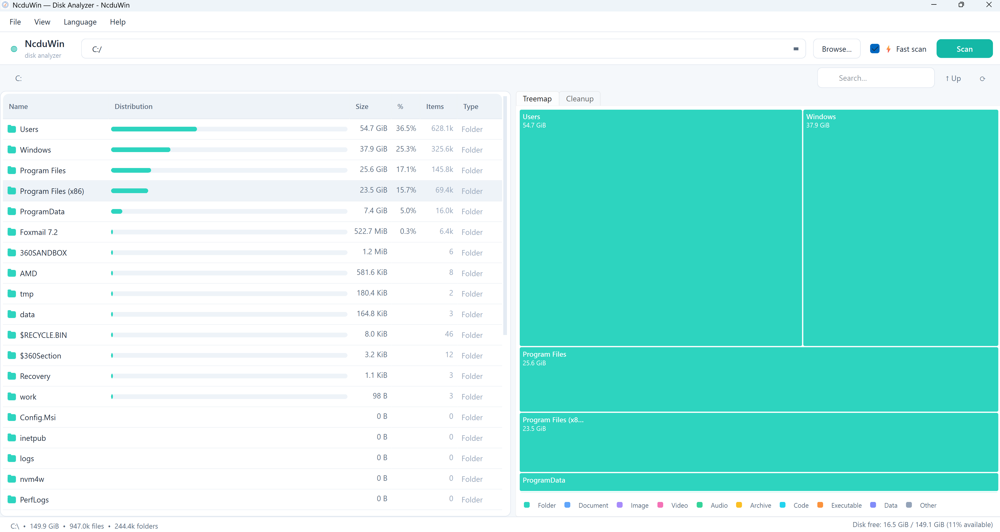
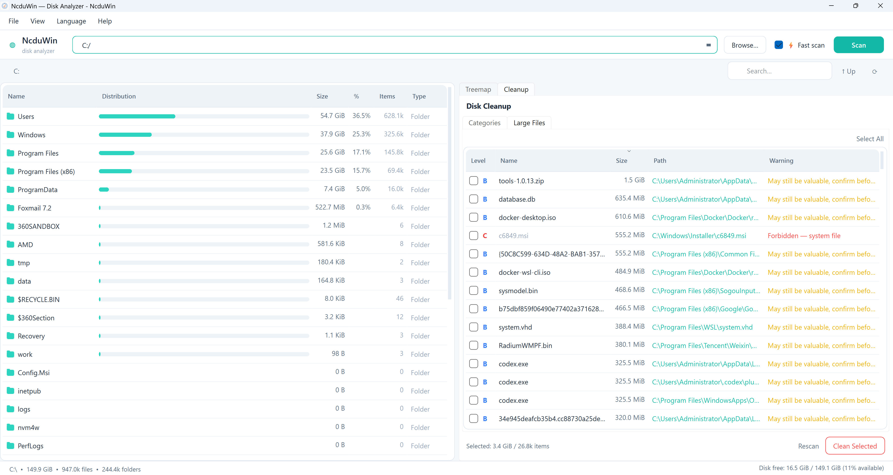

# NcduWin

[](LICENSE)
[](https://en.cppreference.com/w/cpp/17)
[](https://www.qt.io)
[](#支持的平台)
[](#)

**[English](README.md)** | **[中文](README_ZH.md)**

> 一款现代、浅色主题的 Windows 磁盘使用分析器，灵感来自 Linux 的 [`ncdu`](https://dev.yorhel.nl/ncdu)。

NcduWin 是一个原生桌面应用，它扫描您的磁盘并使用 ncdu 风格的文件列表 **和** 矩形树图来可视化文件夹大小。它使用 **C++17 和 Qt 6** 构建，以安装包形式分发（所有依赖已打包），开箱即支持英语和简体中文。

---

## ✨ 功能特性

- **极速扫描** — 多线程磁盘扫描，即使是大硬盘也能快速完成。
- **跳过重型目录** — 可选择性跳过 `node_modules`、`.git` 等大型文件夹的深度扫描，同时仍显示其大小。
- **完整系统访问** — 自动请求管理员权限，支持扫描 `C:\Windows` 和其他用户目录等受保护的系统文件夹。
- **双重视图** — 左侧 ncdu 风格文件列表，右侧交互式树图，直观分析空间占用。
- **智能排序** — 点击任意列按名称、大小、百分比、文件数量或类型排序。
- **软件识别** — 自动识别常见软件安装目录（Adobe、JetBrains、Microsoft Office、Steam 等）和开发项目。
- **面包屑导航** — 快速跳转到任意父目录。
- **悬停提示** — 鼠标悬停时显示完整文件路径和软件识别信息。
- **安全删除选项** — 右键发送到回收站（可撤销）或永久删除。
- **一键磁盘清理** — 专门的清理标签页检测并移除：
  - 常见垃圾：临时文件、浏览器缓存、pip/npm 缓存
  - 大文件（>50MB），带安全等级分类
- **安全优先删除** — 五级安全系统确保不会误删重要文件。
- **启动自动扫描** — 首次启动立即显示用户主目录的空间使用情况。
- **中英双语** — 内置本地化支持，语言选择自动保存。
- **清新现代界面** — 柔和配色、圆角设计、清晰的视觉层次。
- **安装包分发** — 一键安装，自动创建桌面和开始菜单快捷方式，自带卸载程序。

---

## 📸 截图

| 文件列表 + 树图 | 清理面板 |
|---|---|
|  |  |

---

## 🚀 快速开始

### 选项 A — 下载发布版本

1. 前往 [Releases](../../releases) 页面。
2. 下载 `NcduWin_Setup.exe`。
3. 运行安装程序，按提示完成安装。无需任何运行时环境。

### 选项 B — 从源码构建

**环境要求：**
- Windows 10/11
- [Qt 6.x](https://www.qt.io/download)（msvc2019_64 或 msvc2022_64）
- [CMake](https://cmake.org/download/) 3.16+
- Visual Studio 2022（或 Build Tools）含 MSVC

```bash
git clone https://github.com/xiaodingfeng/ncdu-win-qt.git
cd ncdu-win-qt
scripts\build.bat
```

构建脚本产出 `dist\NcduWin_1.0.1_Setup.exe` 安装包（含所有 Qt 依赖）。

### 选项 C — 在 Visual Studio 中打开

1. 启动 **Visual Studio 2022**。
2. **文件 → 打开 → 文件夹**，选择项目根目录。
3. 工具栏 **解决方案配置** 下拉选择 **VS 2022 (Debug)**。
4. **启动项** 下拉将显示 `NcduWin.exe` — 选中它。
5. 按 **F5** 编译并运行。

> 项目会自动检测 `C:\Qt\6.x\` 下的 Qt 6 安装。
> Debug 和 Release 构建均会自动部署对应版本的 Qt DLL。

---

## 📁 项目布局

```
ncdu-win-qt/
├── src/                    # C++ 源码
│   ├── main.cpp            # 入口
│   ├── version.h.in        # 版本模板（由 CMake 处理）
│   ├── core/               # 核心数据与工具
│   │   ├── DiskScanner.h/cpp
│   │   ├── FileNode.h
│   │   ├── FormatHelpers.h/cpp
│   │   ├── I18n.h/cpp
│   │   ├── Identify.h/cpp
│   │   └── WinApi.h/cpp
│   ├── ui/                 # UI 组件
│   │   ├── BreadcrumbBar.h/cpp
│   │   ├── LegendBar.h/cpp
│   │   ├── MainWindow.h/cpp
│   │   ├── SizeBarDelegate.h/cpp
│   │   ├── Style.h
│   │   └── TreemapWidget.h/cpp
│   └── cleanup/            # 清理功能
│       ├── CleanupPanel.h/cpp
│       ├── CleanupScanner.h/cpp
│       ├── CleanupTarget.h
│       └── CleanupWorker.h/cpp
├── locales/                # i18n JSON 文件
│       ├── en.json
│       └── zh.json
├── scripts/
│   ├── build.bat           # 构建脚本 (CMake + MSVC + windeployqt + ISCC)
│   ├── installer.iss       # Inno Setup 安装包脚本
│   └── version.iss.in      # 安装包版本模板
├── tests/
│   ├── test_scanner.cpp    # C++ 单元测试 (Qt Test)
├── docs/
│   └── screenshots/
│       ├── treeMap.png
│       └── cleanup.png
├── app.ico
├── app.manifest
├── CMakeLists.txt
├── LICENSE
├── README.md
└── README_ZH.md
```

---

## ⌨️ 键盘快捷键

| 快捷键 | 操作 |
|---|---|
| `Ctrl+O` | 打开文件夹… |
| `F5` | 重新扫描当前目录 |
| `Ctrl+Q` | 退出 |
| `Backspace` | 跳转到父文件夹 |
| `Enter` / `Return` | 打开选中的文件夹 |
| `Delete` | 将选中项移至回收站 |
| `Shift+Delete` | 永久删除选中项 |
| `Ctrl+F` | 聚焦搜索框 |
| `Esc` | 清除搜索 / 返回上层 |

---

## 🌍 添加翻译

1. 复制 `locales/en.json` 到 `locales/<code>.json`（例如 `ja.json`、`fr.json`）。
2. 翻译所有值。
3. 在 `src/core/I18n.cpp` 中注册语言：
   ```cpp
   {"en", "English"},
   {"zh", "简体中文"},
   {"ja", "日本語"},
   ```
4. 新语言将自动出现在 **语言** 菜单中。

---

## 🧪 开发

### 命令行构建
```bash
scripts\build.bat
build\Release\test_scanner.exe   # 运行单元测试
```

### Visual Studio 构建
打开项目文件夹，工具栏选择 **VS 2022 (Debug)** 预设即可。
Debug 和 Release 构建均支持，Qt DLL 自动部署。

---

## 📝 许可证

MIT © NcduWin Contributors。详见 [LICENSE](LICENSE)。

本项目灵感来自 Yoran Heling 的 [`ncdu`](https://dev.yorhel.nl/ncdu)，并使用 Bruls、Houtman 和 van Wijk（2000）的矩形树图算法。所有商标归各自所有者所有。
